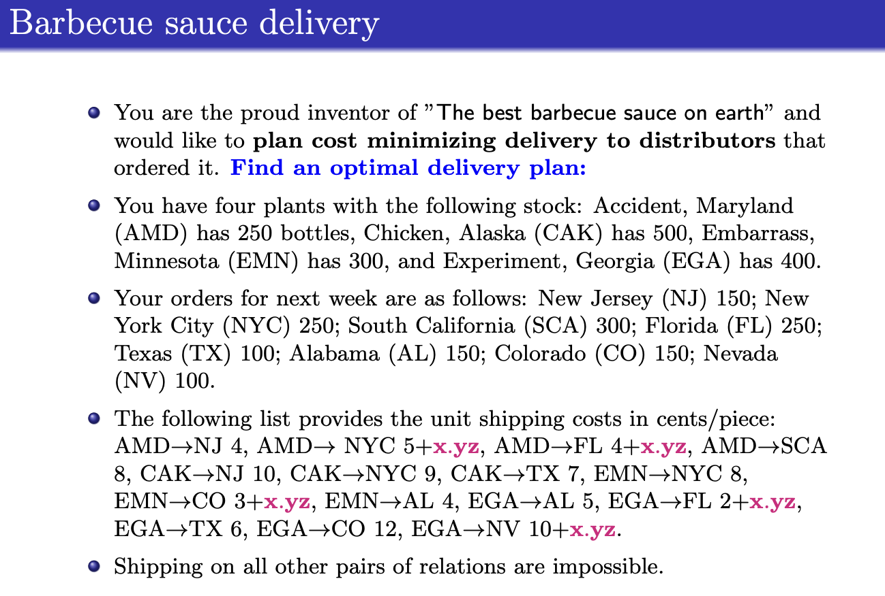

## Barbecue Sauce Delivery – Transportation Cost Minimization

This project explores a classic transportation optimization problem  
As the founder of “the best barbecue sauce on earth,” you must deliver bottles from your production plants to distributors across the country. With varying shipping costs and supply/demand constraints, the objective is to find a cost-minimizing delivery plan that fulfills every order exactly while respecting stock limits

### Problem Details
- 4 plant locations with limited stock:
  - Accident, MD (AMD): 250 bottles
  - Chicken, AK (CAK): 500 bottles
  - Embarrass, MN (EMN): 300 bottles
  - Experiment, GA (EGA): 400 bottles
- 8 distributor locations with known demand:
  - NJ, NYC, SCA, FL, TX, AL, CO, NV
- Only certain plant-distributor pairs are allowed, each with a specific shipping cost (some include a dynamic cost modifier `x.yz`)
- Objective: minimize total shipping costs while fulfilling demand and not exceeding supply

**Visual Prompt**  

For the full prompt:
- [`BBQ-Delivery.pdf`](./BBQ-Delivery.pdf)

### Files Included
- [`BBQ-DM.mod`](./BBQ-DM.mod) – AMPL model file
- [`BBQ-DM.dat`](./BBQ-DM.dat) – AMPL data file (including plant stocks, customer demands, and shipping costs)
- [`Model, Solution, and Explanation.txt`](./Model%2C%20Solution%2C%20and%20Explanation.txt) – Model explanation, solver output, and optimal shipping routes
- Prompt PDF and PNG snapshot

### Solution Summary
- Objective: **Minimize total shipping cost**  
- Shipping cost modifier: **x.yz = 7.61**
- Optimal delivery assignments:
  - AMD → SCA: 250
  - CAK → NJ: 150, NYC: 250, SCA: 50, TX: 50
  - EGA → FL: 250, NV: 100, TX: 50
  - EMN → AL: 150, CO: 150

> For model formulation and AMPL output, see: [`Model, Solution, and Explanation.txt`](./Model%2C%20Solution%2C%20and%20Explanation.txt)