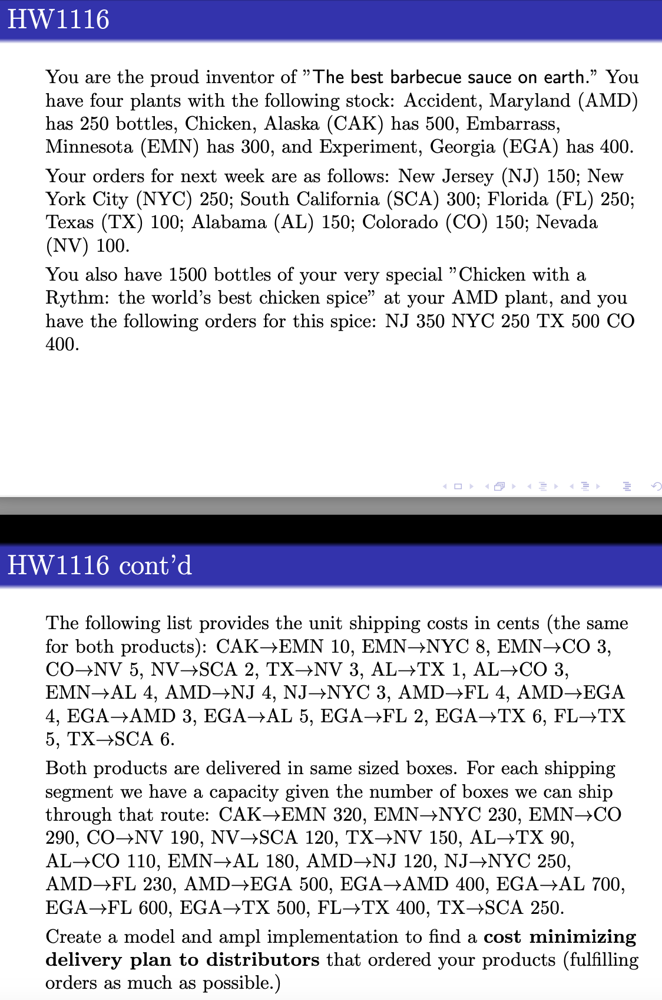

## BBQ Sauce and Spice Delivery – Network Flow Optimization

This project addresses a multi-commodity minimum-cost flow problem with capacity constraints  
As the proud creator of “The best barbecue sauce on earth” and its spicy counterpart, "Chicken with a Rhythm," you need to deliver two different products from your plants to customers across the country. The challenge is to minimize the total shipping cost while adhering to capacity constraints on each shipping route and fulfilling customer demand as fully as possible

### Problem Details
- Two products: BBQ Sauce and Chicken Spice
- Product availability:
  - BBQ Sauce: 4 production plants (AMD, CAK, EMN, EGA) with known stock levels
  - Chicken Spice: 1500 bottles stored at AMD
- Customer orders:
  - BBQ Sauce: 8 distributors (NJ, NYC, SCA, FL, TX, AL, CO, NV)
  - Chicken Spice: 4 distributors (NJ, NYC, TX, CO)
- Shipping network:
  - Unit shipping costs defined for specific edges only
  - Each shipping segment has a maximum number of boxes (capacity)
  - Same shipping costs and capacities apply for both products
- Objective: minimize total transportation cost across both products

**Prompt Overview**  

For reference, see the full prompt:
- [`BBQ.pdf`](./BBQ.pdf)

### Files Included
- [`DM-HW1116.mod`](./DM-HW1116.mod) – AMPL model file
- [`DM-HW1116.dat`](./DM-HW1116.dat) – AMPL data file (nodes, edges, capacities, costs, supply/demand for both products)
- [`Model, Solution, and Explanation.txt`](./Model%2C%20Solution%2C%20and%20Explanation.txt) – Breakdown of modeling logic, output from CPLEX, and final shipping routes
- Prompt PDF and PNG reference

### Solution Summary
- Shipping routes optimized using a **network flow formulation** with two commodity types
- Model simultaneously minimizes total shipping cost while satisfying:
  - Supply constraints at plants
  - Demand requirements at customer sites
  - Capacity limits on each route
- CPLEX solver output confirms feasibility and optimality
- Products were rerouted through multiple hops (e.g., EGA → AMD → FL → TX → SCA)

> For AMPL implementation details and solver output, see: [`Model, Solution, and Explanation.txt`](./Model%2C%20Solution%2C%20and%20Explanation.txt)