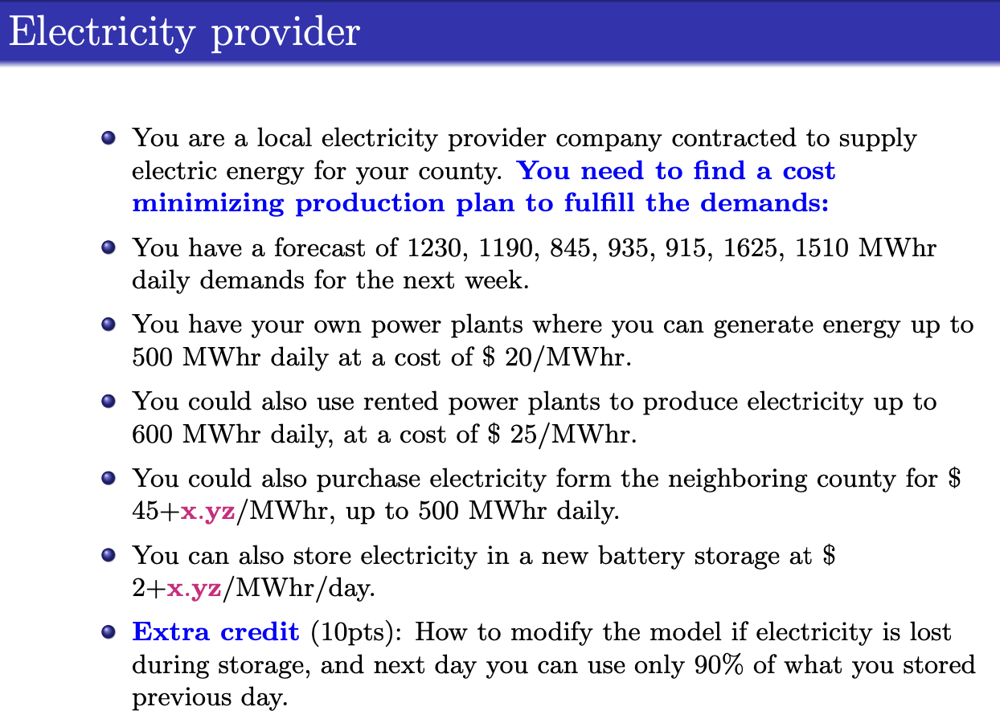

## Electricity Provider – Cost Minimization with Storage Optimization

This project addresses a time-dependent cost minimization problem  
As a local electricity provider, you're responsible for meeting fluctuating daily energy demands over a 7-day period. You must determine how much electricity to produce, rent, purchase, and store each day in order to minimize total costs while ensuring daily demand is met

### Problem Details
- Daily demand forecasts: 1230, 1190, 845, 935, 915, 1625, 1510 MWhr
- Energy can be supplied through:
  - Own plant (≤500 MWhr/day at $20/MWhr)
  - Rented plant (≤600 MWhr/day at $25/MWhr)
  - Neighboring county (≤500 MWhr/day at $45+x.yz/MWhr)
  - Battery storage (costs $2+x.yz/MWhr to store)
- Electricity can be stored and used on future days
- Objective: minimize total production and storage costs across the week

**Prompt Overview**  

For reference, see the full prompt:
- [`Electricity.pdf`](./Electricity.pdf)

### Files Included
- [`Electricity-DM.mod`](./Electricity-DM.mod) – AMPL model file
- [`Electricity-DM.dat`](./Electricity-DM.dat) – AMPL data file
- [`Model, Solution, and Explanation.txt`](./Model%2C%20Solution%2C%20and%20Explanation.txt) – Full output, variable breakdown, and extra credit extension
- PDF and PNG files of the original class prompt

### Solution Summary
- Total demand was met each day using a combination of:
  - Own plant: consistently maxed out at 500 MWhr/day
  - Rented plant: up to 600 MWhr/day
  - Purchased energy: used sparingly for high-demand days
  - Stored energy: used strategically on Day 4 and Day 5
- Energy was stored on:
  - Day 4: 165 MWhr
  - Day 5: 350 MWhr
- Extra credit extension was implemented to account for 10% storage loss across days
- Solver used: **CPLEX via AMPL**

> For model formulation and solver output, see: [`Model, Solution, and Explanation.txt`](./Model%2C%20Solution%2C%20and%20Explanation.txt)