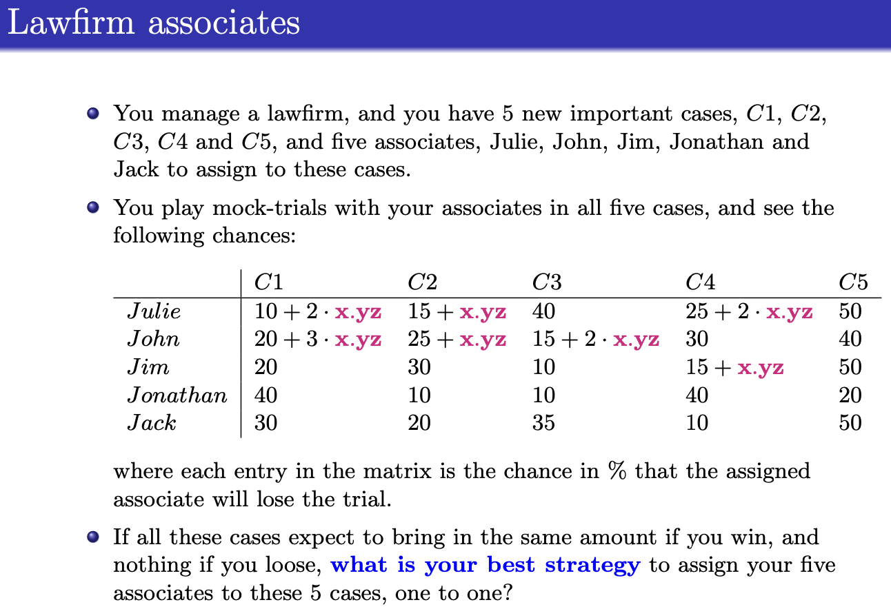

## Lawfirm Associates – Assignment Optimization Problem

This project addresses a one-to-one assignment optimization scenario:

You are managing a law firm with five associates and five high-stakes cases. Based on mock trial simulations, each associate has a known probability of losing a given case. The objective is to assign one associate to each case in a way that maximizes the overall probability of winning all five cases.

### Problem Details
- There are 5 associates and 5 cases (C1–C5)
- Each associate has a unique probability of losing each case
- A 1:1 mapping between associates and cases is required
- Objective: maximize total probability of winning across all assignments

### Problem Prompt Snapshot

For reference, see the full prompt:
- [`Law.pdf`](./Law.pdf)

### Files Included
- [`Law-DM.mod`](./Law-DM.mod) – AMPL model file
- [`Law-DM.dat`](./Law-DM.dat) – AMPL data file
- [`Model, Solution, and Explanation.txt`](./Model%2C%20Solution%2C%20and%20Explanation.txt) – Model logic, solver output, and interpretation
- PDF and PNG files of the original prompt

### Solution Summary
- Optimal assignment:
  - C1 → Julie
  - C2 → Jonathan
  - C3 → Jim
  - C4 → Jack
  - C5 → John
- Objective value: **404.78**, corresponding to an **80.96% cumulative chance of winning all cases**
- Solver used: **CPLEX via AMPL**

> For full model logic and variable breakdown, see: [`Model, Solution, and Explanation.txt`](./Model%2C%20Solution%2C%20and%20Explanation.txt)